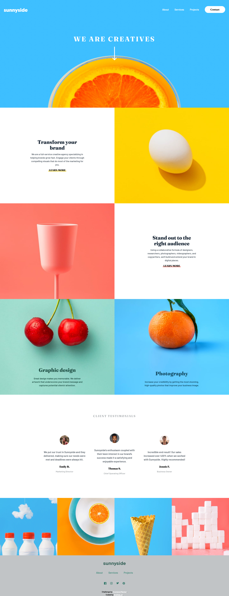
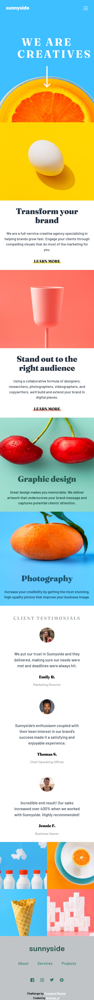
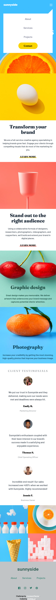

# Frontend Mentor - Sunnyside agency landing page solution

This is a solution to the [Sunnyside agency landing page challenge on Frontend Mentor](https://www.frontendmentor.io/challenges/agency-landing-page-7yVs3B6ef). Frontend Mentor challenges help you improve your coding skills by building realistic projects.

## Table of contents

- [Overview](#overview)
  - [The challenge](#the-challenge)
  - [Screenshot](#screenshot)
  - [Links](#links)
- [My process](#my-process)
  - [Built with](#built-with)
  - [Process](#process)
  - [What I learned](#what-i-learned)
  - [Continued development](#continued-development)
  - [Useful resources](#useful-resources)
  - [AI Collaboration](#ai-collaboration)
- [Author](#author)
- [Acknowledgments](#acknowledgments)

## Overview

### The challenge

Users should be able to:

- View the optimal layout for the site depending on their device's screen size
- See hover states for all interactive elements on the page

### Screenshot

preview desktop: 

preview mobile: 
preview mobile open menu: 

### Links

- Solution URL: [solution URL](https://github.com/arshiya-sr/frontend-mentor-Agency-landing-page-Project)
- Live Site URL: [live site URL](https://arshiya-sr.github.io/frontend-mentor-Agency-landing-page-Project/)

## My process

### Built with

- Semantic HTML5 markup
- CSS custom properties
- Advanced CSS
- Flexbox
- CSS Grid
- Mobile-first workflow
- Media queries
- Deepseek AI

### Process

This project took much longer than it should have, because with the start of school I had less time to work on my own interests. And whenever I did find time for it, I was doing it while tired, which lowered my productivity. But I managed to finish it in the end. 

As always, I first went to the base files—main CSS, CSS reset, fonts, and so on. Then, based on the project's desktop image, I built the HTML structure as best I could. 

After that, I went piece by piece through the mobile layout for design and styling, and then moved from mobile to desktop, where I ran into a lot of struggles because of the particular layout involved, but ultimately I overcame them with the help of AI. 

After building the desktop layout, I moved on to debugging and adding animations. 

There are still a few small bugs and shortcomings in the project that will be fixed in the future.

### What I learned

The most important thing I learned is that working with little time and while tired slows things down a lot and makes the work drag.

### Continued development

Probably no additional or special work will be done on this project in the future. However, debugging and optimization will definitely be done after receiving the Frontend Mentor report and other people's comments and reviews.

### Useful resources

- [Deepseek AI](https://www.deepseek.com) - DeepSeek has helped me immensely on my learning journey—it's far better to use it for truly understanding concepts than for just getting answers and bypassing the work. And it helped me a lot more on this project.
- [github copilot AI](https://github.com/copilot) - GitHub Copilot has also been a huge help, especially when it comes to coding.
- [freecodecamp free online course](https://www.freecodecamp.org) - I gained my web development knowledge through freeCodeCamp, which is completely free and packed with resources: theory, labs, workshops, quizzes, and even review projects that help you master each topic. This project itself comes from freeCodeCamp, so a big thank-you to them.

### AI Collaboration

- What tools did you use (e.g., ChatGPT, Claude, GitHub Copilot)? i only used deepseek and github copilot AI a lot.
- How did you use them (e.g., debugging, generating boilerplate, brainstorming solutions)? i used it to help me understand the structure and debug small pieces of codes. also github copilot helped me nearly in all of it. It's really good.

## Author

- Github - [my github](https://github.com/arshiya-sr)
- Frontend Mentor - [my frontend mentor](https://www.frontendmentor.io/profile/arshiya-sr)
- freeCodeCamp - [my freecodecamp](https://www.freecodecamp.org/arshiya_sr)

## Acknowledgments

thank to Frontend Mentor for this awesome Project/Challenge, and thank to you for paying your time and attention to my project. I'd be so happy to receive your advice and recommendations.
Hope you a good day ♥